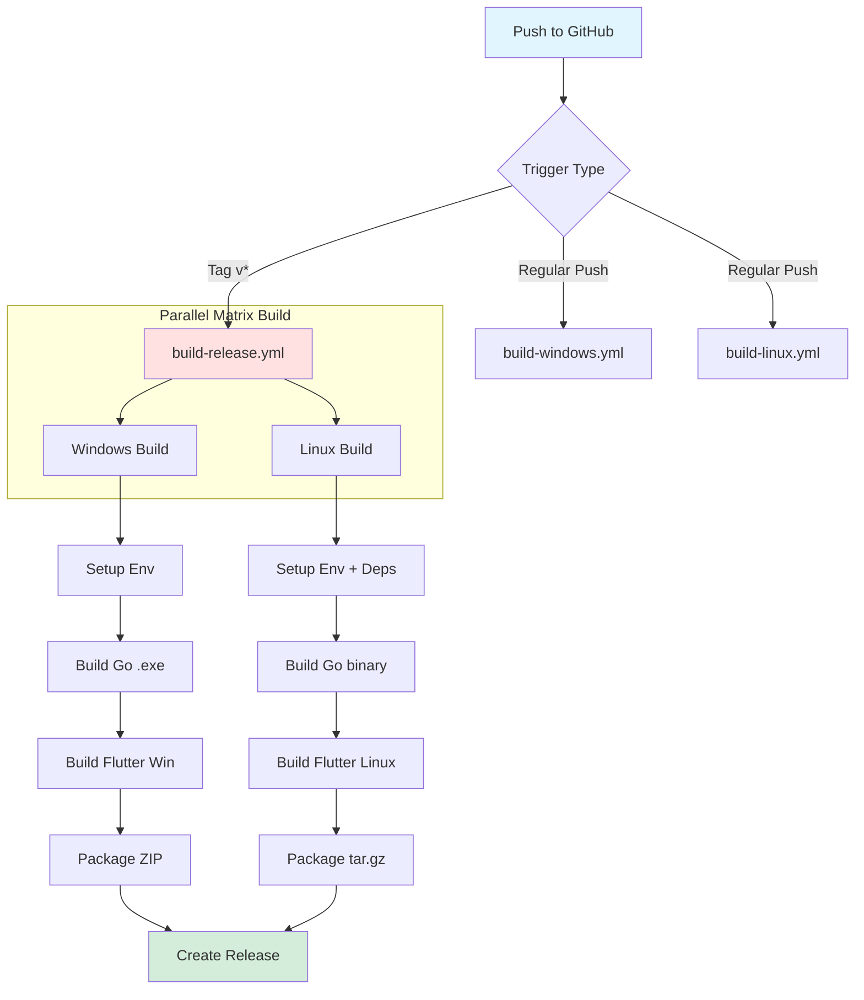
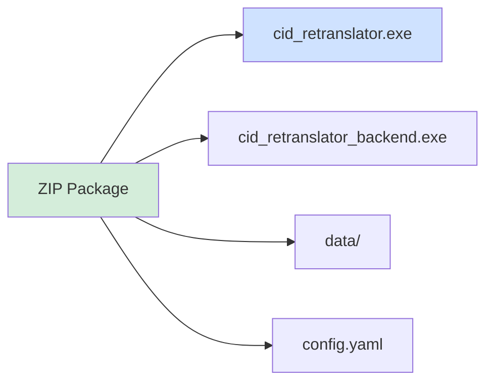
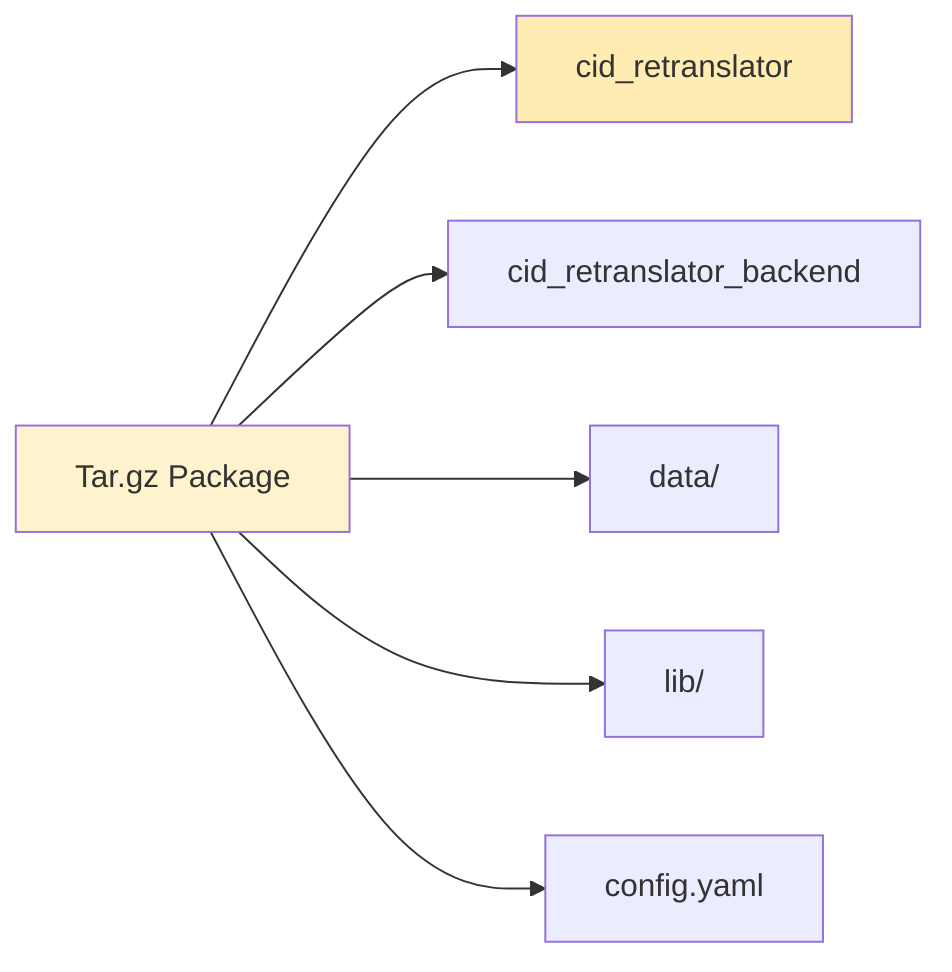
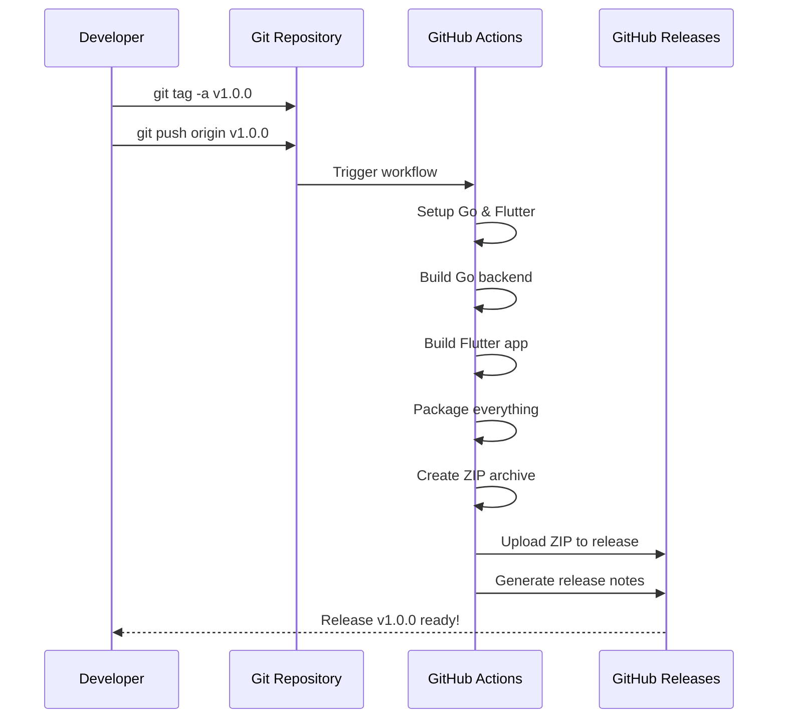
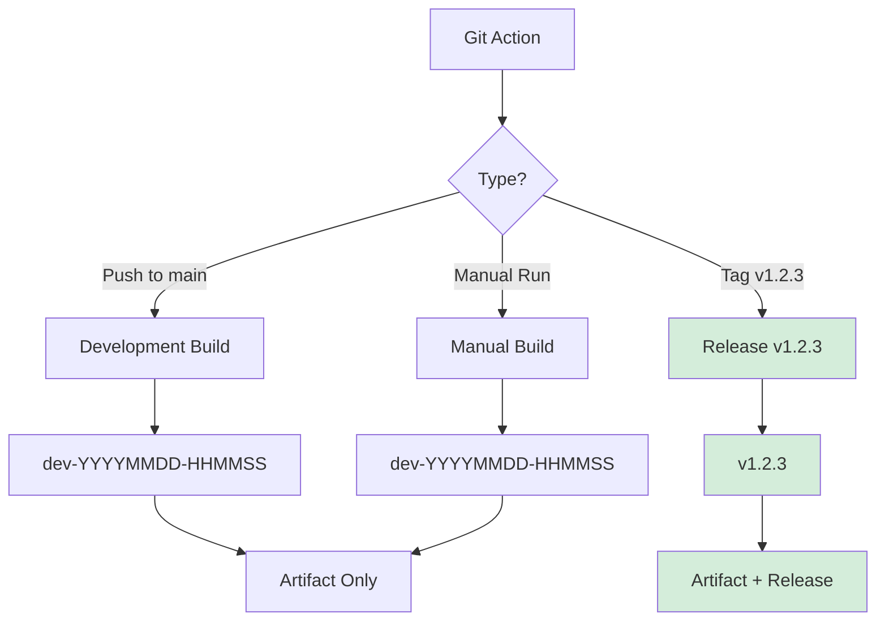

# CI/CD Workflow Diagram

## Build Process Flow

## Package Contents

### Windows (.zip)

### Linux (.tar.gz)

## Release Workflow

## Version Types

## Build Time Breakdown

| Stage | Estimated Time | Cached |
|-------|---------------|--------|
| Checkout | 10-20s | ❌ |
| Setup Go | 20-30s | ✅ |
| Setup Flutter | 60-90s | ✅ |
| Build Go Backend | 30-60s | Partial |
| Flutter pub get | 20-30s | ✅ |
| Flutter analyze | 10-20s | ❌ |
| Build Flutter App | 120-240s | Partial |
| Package & ZIP | 30-60s | ❌ |
| Upload | 20-40s | ❌ |
| **Total** | **5-10 min** | |

---

💡 **Tip:** Перший build займе більше часу, наступні будуть швидші завдяки кешуванню.
